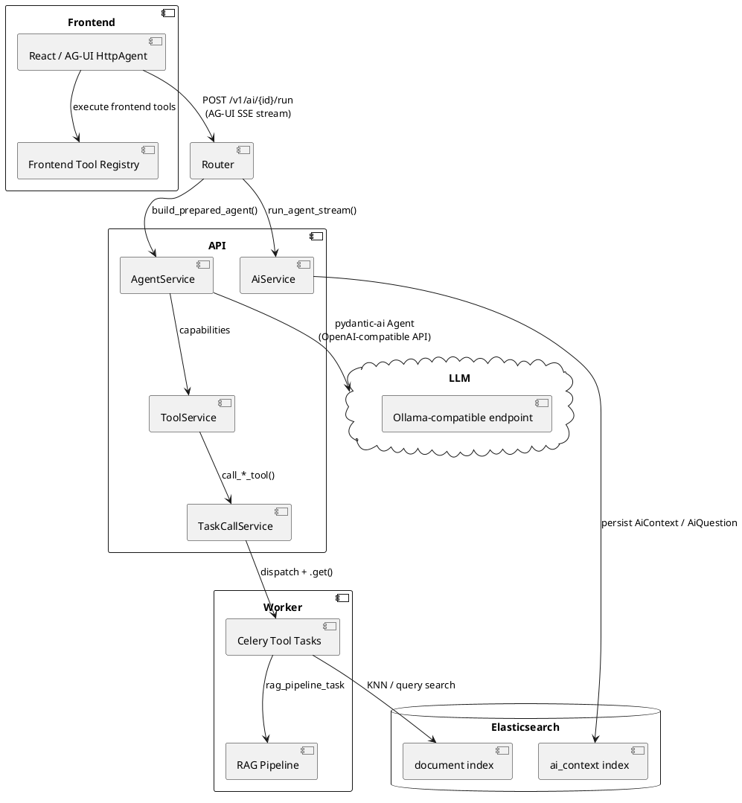
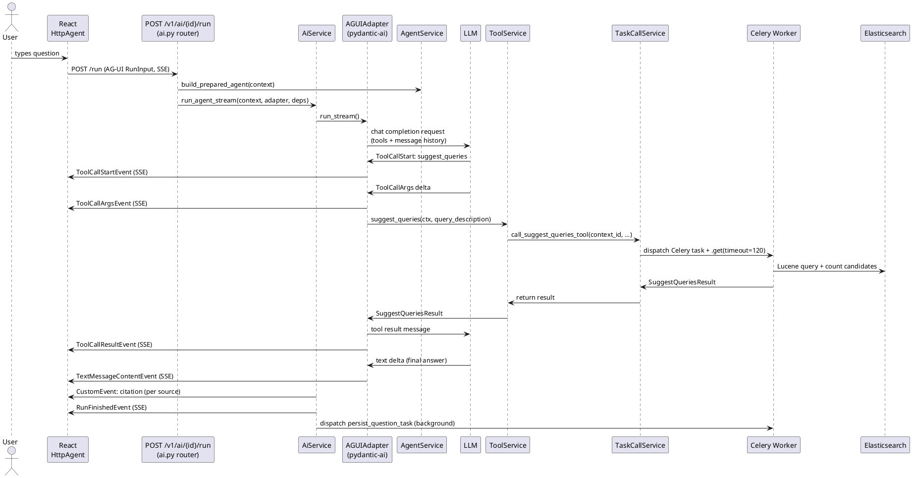
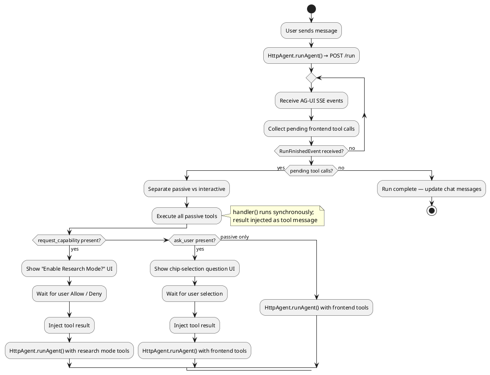
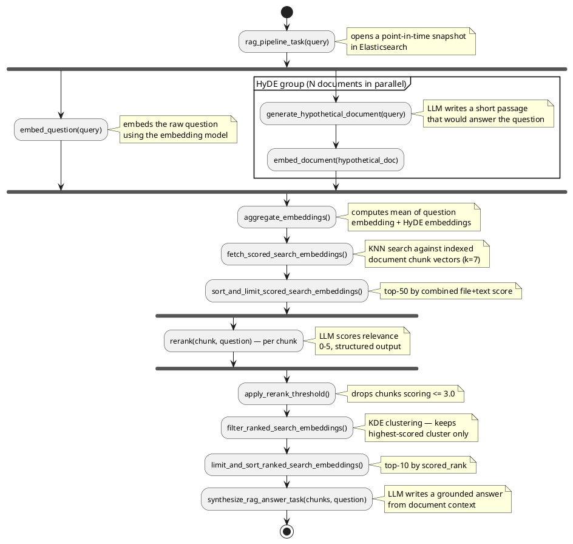

# AI Chatbot Architecture

Loom's AI chatbot lets users explore their indexed document corpus through natural language. Instead of
writing Lucene query strings by hand, users ask questions and the agent translates intent into search
actions, reads documents, manipulates the search UI, and synthesizes answers grounded in the corpus.

Tools are organised into **capabilities** — groups of related tools that the agent loads together.
Three capabilities are always active (`search_and_browse`, `file_access`, `ai_processing`), while
**Research Mode** (`research_mode`) is a dynamic capability that is activated on user opt-in. When
active, it adds full Elasticsearch queries and the RAG pipeline, and its system-prompt instructions
steer the agent toward thorough, multi-faceted research.

---

## Architecture Overview



---

## Key Concepts

### AiContext

`AiContext` is the persistent container for a conversation. It is stored in the `ai_context`
Elasticsearch index and holds:

- **`questions`** (`list[AiQuestion]`) — the accumulated Q&A history. Each `AiQuestion` stores the
  question text, the agent's answer, `citations` (referenced file IDs with text snippets), and an
  `activity` list — an ordered record of `ToolCallActivityEntry` (name, inputs, output for each
  backend tool invocation) and `ReasoningActivityEntry` (LLM thinking traces) items.
- **`active_capabilities`** (`list[str]`) — opt-in flags that alter agent behaviour. Currently the
  only defined capability is `"research_mode"`.

A new context is created per conversation via `POST /v1/ai`. The frontend fetches its history on
load via `GET /v1/ai/{context_id}/history`.

### Agent and Tools

`AgentService` wraps a single pydantic-ai `Agent` configured with an OpenAI-compatible LLM (served
by Ollama or a compatible endpoint). It is the only client whose prompt carries more than one system
message, so it is the only one affected by the merging the self-hosted providers ask for (see
[System message merging](#system-message-merging)). The agent is initialised with `capabilities=tool_service.capabilities`, which
provides four `Capability` groups. Three are always active; `research_mode` is a dynamic capability
whose activation callback checks `AgentDeps.active_capabilities` at runtime.

Tools are split into two tiers:

- **Backend tools** — Python functions in `ToolService` that call `TaskCallService`, which
  dispatches a Celery task synchronously (`.get(timeout=…)`) and returns a typed result model.
- **Frontend tools** — TypeScript functions registered in the React frontend. The agent declares
  them as deferred tools; the frontend executes them after each agent run and re-submits results.

### Provider

Pointing a client at an endpoint takes one setting beyond the endpoint and the model name:

| Setting                 | Answers                             | Values                                                |
| ----------------------- | ----------------------------------- | ----------------------------------------------------- |
| `llm.<client>.provider` | Which service answers at `endpoint` | `ollama` (default), `litellm`, `infomaniak`, `openai` |

**`provider`** is pydantic-ai's term for the class handling authentication and the connection to one
LLM service — one class per service, so one setting value per service. It is an enum: an unrecognised
value fails at startup with the accepted options listed, rather than being silently ignored.

The model class is always `OpenAIChatModel`; per pydantic-ai's guidance, an OpenAI-compatible API needs
a custom *provider*, not a custom model class, and `common/llm/provider.py` is where each service's
quirks live:

| Value        | Class                 | Why it is not the stock one                                                                                                                                                                                                    |
| ------------ | --------------------- | ------------------------------------------------------------------------------------------------------------------------------------------------------------------------------------------------------------------------------ |
| `ollama`     | `LoomOllamaProvider`  | Matches the family off the re-uploaded name (below). Also withholds `max_completion_tokens`, which Ollama's request struct does not have, and claims `supports_thinking`.                                                      |
| `litellm`    | `LoomLiteLLMProvider` | Upstream reads the family from a `vendor/model` prefix; fronting vLLM, the served name carries none. Matches it off the name instead, and claims `supports_thinking`.                                                          |
| `infomaniak` | `InfomaniakProvider`  | Serves open-weight models under short slugs, and answers `422 validation_failed` for request fields it does not know — so `max_completion_tokens` is withheld. Claims `supports_thinking`, which was measured against the API. |
| `openai`     | `OpenAIProvider`      | Stock. The one service whose own table knows its models, per model.                                                                                                                                                            |

#### Model families

A model family carries the request-construction rules for the weights — above all
`json_schema_transformer`, which decides how JSON schemas are serialised for the `NativeOutput`
structured-output calls (`$defs` inlined rather than referenced). Getting it wrong surfaces as the
model failing to produce parseable output, not as an error.

pydantic-ai infers the family from the model name by prefix, which misses two cases Loom hits:
community re-uploads published under an author namespace (`huihui_ai/qwen3.5-abliterated:9b` matches
nothing), and services whose own lookup table does not cover open weights at all. `_family_profile()`
in `common/llm/provider.py` closes both — it drops the namespace, lowercases, and prefix-matches
`llama`, `gemma`, `qwen`, `qwq`, `deepseek`, `mistral`, `mixtral` and `gpt-oss` — and every provider
above except `openai` layers it in.

There is no `family` setting: the name in `llm.<client>.model` is the claim. On LiteLLM/vLLM, where
the served name is whatever the operator configured, **name the deployment after the weights** — a
model served as `prod-deployment-1` matches nothing and gets no family rules.

#### How the profile is layered

Each provider's `model_profile` merges its own layers, lowest first:

1. **Upstream's provider profile** — what the service accepts.
2. **The family** — above the provider because it describes the *model*, and every provider claims
    `json_schema_transformer` unconditionally; a generic OpenAI transformer applied to Qwen breaks
    structured output.
3. **Loom's claims** — `supports_thinking` for services where no lookup table recognises the model
    name. Above the family because gemma and gpt-oss both set `supports_thinking=False`, which from any
    lower layer would strip `thinking` from every request again (#307). That `False` is not knowledge
    about the weights: gemma gets it from Google's `'gemini-2.5' in model_name` test and gpt-oss from
    OpenAI's reasoning table, both of which only ever recognise that vendor's hosted models.

4. **System message merging** — for the services that execute an open-weight chat template.

The model is built with no `profile=` argument at all: every layer is a fact about the service or
about the weights, and the provider is where both are known.

#### System message merging

`LoomOllamaProvider`, `LoomLiteLLMProvider` and `InfomaniakProvider` set
`openai_chat_supports_multiple_system_messages=False` and `supports_inline_system_prompts=False`,
which merge consecutive leading system messages into one and demote the ones that follow (e.g.
tool-availability announcements after `load_capability`) to user-role text.

This is required when the model's chat template accepts only a single leading system message and the
service executes that template — vLLM behind LiteLLM, rendering Qwen's template, answers `System
message must be at the beginning` as soon as a capability's instructions add a second
`InstructionPart`. Ollama and Infomaniak run the same family of templates, so they claim it too;
where it is not needed it costs nothing, being a no-op on the single leading instruction every client
except `llm.agent` sends. `OpenAIProvider` does not claim it: the API takes repeated system messages
at full weight, and demoting them would weaken instructions for no reason.

There is no setting. Whether a service accepts more than one system message is a property of that
service, not something an operator chooses.

### Thinking

Every chat LLM client has a `thinking` setting (`llm.<client>.thinking` in Helm, where `<client>` is
the same name the client carries in `LLMSettings`), which `build_agent` turns into pydantic-ai's
unified `thinking` model setting:

| Value   | Sent as                    | Effect                                                |
| ------- | -------------------------- | ----------------------------------------------------- |
| `true`  | `reasoning_effort: medium` | Thinking on                                           |
| `false` | `reasoning_effort: none`   | Thinking off                                          |
| `null`  | nothing                    | Parameter omitted — the model applies its own default |

Ollama, LiteLLM/vLLM and Infomaniak all accept `reasoning_effort` on `/v1/chat/completions` and
translate it themselves: Ollama converts it back into its native `think` value, and vLLM converts it
into the `enable_thinking` chat-template variable that Qwen's template reads. Reasoning text comes
back in a `reasoning` field on the message in every case, which pydantic-ai turns into the
`ThinkingPart`s that become `ReasoningActivityEntry` items.

Infomaniak was measured rather than assumed, against `Qwen/Qwen3.5-122B-A10B-FP8`: `none` and
`medium` both answer 200, and `none` takes the model from 269 completion tokens to 4. It is the one
service that validates request fields strictly, so `max_completion_tokens` stays withheld — that one
is still unmeasured.

Three things to know:

- The translation only happens because every provider except `openai` sets `supports_thinking` on the
  model profile. pydantic-ai defaults that to `False` and strips the setting without warning, so
  removing it makes every `thinking` value silently inert.
- For the same reason the merge order inside `model_profile` matters: the family profile is merged
  *under* that claim. The gemma and gpt-oss profiles set `supports_thinking=False` themselves, so
  merging them on top would strip `thinking` again for those families.
  `test_thinking_survives_every_family` guards this with one model name per family.
- On Ollama the model has to *have* the thinking capability. `reasoning_effort` above `none` becomes
  a native `think`, and the chat handler answers `400 "<model>" does not support thinking` rather
  than ignoring it — so pointing a client with `thinking: true` at a non-reasoning checkpoint turns
  every one of its calls into a hard failure. `none` is always accepted. This is why
  `values-development.yaml` sets `thinking: false` on the four clients it swaps onto
  `qwen2.5:0.5b`, which does not reason; the default `huihui_ai/qwen3.5-abliterated:9b` does.
- The model's chat template has the final say. A checkpoint whose template ignores
  `enable_thinking`, or one that always reasons, will keep thinking no matter what is sent. Check a
  new model with:

  ```bash
  curl -s http://ollama.loom/v1/chat/completions -H 'Content-Type: application/json' \
    -d '{"model":"<model>","reasoning_effort":"none","messages":[{"role":"user","content":"What is 17*23?"}]}' \
    | jq '.choices[0].message.reasoning'
  ```

Defaults are set per client in `LLMClientSettings` subclasses: on for `summarization`,
`summarization_refine`, `rag_synthesize` and `agent`; off for `summarization_key_points`,
`rag_hyde`, `rag_rerank`, `suggest_queries`, `vision`, `language_detection` and `translation`.
Clients that reason spend part of `max_tokens` on reasoning tokens — see #287.

`rag_rerank` and `suggest_queries` are the two defaults that are off for a cost reason rather than a
quality one. Both fan out many calls per invocation against an inference server that answers them
one at a time, and both spend that fan-out on a tiny answer.

`rerank_and_synthesize` fans out one call per chunk, capped at
`MAX_SCORED_SEARCH_EMBEDDINGS_FOR_RERANKING` (50), and the inference server answers them one at a
time — so a question's rerank wall-clock is the sum of all 50 generations, while the whole useful
output is a single integer score. It also carries `max_tokens = 512` for the same reason: the
inherited 128000 caps nothing that matters there, but lets one runaway generation consume the
5-minute `timeout`, which `rerank` then retries up to `RAG_MAX_RETRIES` times on an already saturated
queue. Turning thinking back on for ranking quality means keeping that cap, and either lowering the
fan-out or giving the inference server real concurrency (`OLLAMA_NUM_PARALLEL`).

`suggest_queries` is the same shape one level down: one invocation fans out
`tool.suggest_queries.num_candidates` (10) generations, so a suggestion's wall-clock is the sum of
all ten, and each one's whole useful output is a short Lucene query string. Unlike `rag_rerank` it
keeps the inherited `max_tokens`, so turning thinking back on there — for a model that needs the
budget to get Lucene syntax right — costs latency but nothing else.

`embedding` has no `thinking` setting: the embeddings API has no reasoning to switch off, and
`build_embedder` reads only `extra_headers`/`extra_body`.

### AG-UI Streaming Protocol

The agent run is exposed as a Server-Sent Event (SSE) stream via pydantic-ai's `AGUIAdapter`. The
frontend connects using `@ag-ui/client`'s `HttpAgent`, which manages the message history and
re-run loop.

Key event types emitted downstream:

| Event | Meaning |
| --- | --- |
| `ToolCallStartEvent` | Agent started calling a tool |
| `ToolCallArgsEvent` | Incremental tool argument delta |
| `ToolCallResultEvent` | Tool returned a result |
| `TextMessageContentEvent` | Incremental text delta for the assistant reply |
| `CustomEvent` (`"citation"`) | A source file referenced in the answer |
| `RunFinishedEvent` | The agent run completed (or was interrupted for frontend tools) |

---

## Backend Tool Architecture

The following sequence shows a typical backend tool call through the stack.



After streaming completes, `AiService` emits `CustomEvent` messages for each deduplicated citation,
then `RunFinishedEvent`, then fires a background Celery task (`persist_question_task`) to append the
`AiQuestion` to the context in Elasticsearch — without blocking the response.

---

## Frontend Tool Architecture

Frontend tools run entirely in the browser. They are registered in `FrontendToolRegistry` and
advertised to the backend as deferred tool definitions. The LLM may call them like any other tool;
the frontend intercepts the call after each run finishes and executes the handler locally.

Tools are split into two categories:

### Passive tools (`interactive: false`)

Execute automatically — the handler runs, the result is injected as a `tool` message, and the agent
re-runs immediately.

| Tool | Purpose |
| --- | --- |
| `discover_state` | Returns a schema describing the available UI state keys |
| `read_state` | Reads a specific UI state slice (search query, filters, …) |
| `get_this_file` | Returns the file currently open in the detail pane |
| `get_these_files` | Returns the files currently visible in the search results |
| `set_search_query` | Updates the search bar query string |
| `navigate_to_file` | Opens a file in the detail pane |
| `close_file` | Closes a file in the detail pane |
| `highlight_file` | Highlights a file card in the search results |
| `navigate_sidebar` | Opens a specific panel in the right sidebar (summary, translate, …) |
| `update_file_flags` | Sets or clears a flag on a file |
| `add_tags_to_file` | Adds one or more tags to a file |
| `save_custom_query` | Saves the current query as a named custom query |
| `set_statistics_view` | Switches the statistics panel to a given view |
| `open_file_dialogs` | Opens a file action dialog (e.g. share, delete) |

### Interactive tools (`interactive: true`)

Pause execution and show UI; the agent re-runs only after the user responds.

| Tool | Purpose |
| --- | --- |
| `ask_user` | Presents a question and a set of chip options to the user for selection |
| `request_capability` | Asks the user to grant (or deny) a capability such as `research_mode` |

---

## Frontend Tool Execution Loop



In Research Mode, the frontend only advertises `get_this_file` (not the full UI manipulation
toolset) so the agent focuses on research rather than UI control.

---

## Available Tools Reference

### Backend tools

| Tool | Capability | Description |
| --- | --- | --- |
| `suggest_queries` | `search_and_browse` | Generates ranked Lucene query candidates from a natural language description. Optional `folder_path` parameter restricts results to a subtree. |
| `list_folder_contents` | `search_and_browse` | Lists direct children (subfolders and files) of a folder path |
| `search_by_filename` | `search_and_browse` | Finds files whose name contains a given substring |
| `get_file` | `file_access` | Returns the full path and available field list for a file by UUID |
| `get_file_field` | `file_access` | Reads the value of a specific field for a file (e.g. `content`, `summary`) |
| `summarize_file` | `ai_processing` | Triggers AI summarization for a file and returns the summary |
| `translate_file` | `ai_processing` | Triggers AI translation for a file and returns the translated text |
| `describe_image` | `ai_processing` | Triggers AI image description for an image file |
| `execute_query` | `research_mode` | Executes a Lucene query and returns matching files with snippets. Optional `folder_path` parameter restricts results to a subtree. |
| `rag_search` | `research_mode` | Runs the full RAG pipeline and returns a synthesized answer |

### Frontend tools

| Tool | Category | Description |
| --- | --- | --- |
| `discover_state` | passive / state reading | Returns a description of the available UI state keys |
| `read_state` | passive / state reading | Reads a UI state slice by key |
| `get_this_file` | passive / state reading | Returns the currently open file (available in all modes) |
| `get_these_files` | passive / state reading | Returns the files currently visible in the search results |
| `set_search_query` | passive / action | Updates the search bar with a new query string |
| `navigate_to_file` | passive / action | Opens a file in the detail pane |
| `close_file` | passive / action | Closes a file in the detail pane |
| `highlight_file` | passive / action | Highlights a file card in the results list |
| `navigate_sidebar` | passive / action | Switches to a specific right-sidebar panel |
| `update_file_flags` | passive / action | Sets or clears a flag on a file |
| `add_tags_to_file` | passive / action | Applies tags to a file |
| `save_custom_query` | passive / action | Saves the current search as a named custom query |
| `set_statistics_view` | passive / action | Switches the active statistics chart |
| `open_file_dialogs` | passive / action | Opens file action dialogs |
| `ask_user` | interactive | Pauses execution and prompts the user with a multiple-choice question |
| `request_capability` | interactive | Asks the user to grant a capability (e.g. `research_mode`) |

---

## RAG Pipeline

The `rag_search` tool triggers `rag_pipeline_task` in the Celery worker, which orchestrates a
multi-stage retrieval pipeline using `self.replace()` to chain tasks:



Each stage is a discrete Celery task with auto-retry on LLM errors. The pipeline returns a
`RagSearchResult` containing the synthesized answer and the source `ToolSource` list used to
populate citations.

### Failure Handling in the Fan-Outs

Both `fork` blocks above are Celery chords, and a chord aborts as soon as one of its members
fails — discarding the results of every sibling that already succeeded. Members whose
contribution is optional therefore degrade instead of raising once their retry budget is
exhausted:

| Task | Behaviour once retries are exhausted |
| ------ | -------------------------------------- |
| `generate_hypothetical_document` | Returns no document; recall degrades |
| `embed_document` | Returns no embedding; `aggregate_embeddings` skips it |
| `rerank` | Falls back to the minimum rank, so `apply_rerank_threshold` drops the chunk |
| `embed_question` | Fails the pipeline — without the question embedding there is nothing to search |

Every failure out of an `Agent.run_sync()` call counts as an LLM failure: the agent layer
surfaces transport errors, `LengthFinishReasonError` when the model burns its token budget before
emitting valid JSON, and `ValidationError` when the emitted JSON violates the output schema — so
the tasks catch `Exception` around the call rather than a narrow error set. The embedding client
is still called directly and retries on `APIError`. The same degradation applies to the
`suggest_queries` fan-out, whose candidates degrade to an empty suggestion.

---

## Persistence Model

`AiContext` is stored in the Elasticsearch index `ai_context`. The document structure mirrors the
Pydantic model: a nested `questions` array (each an `AiQuestion` with `citations` and `activity`),
and an `active_capabilities` keyword list.

Persistence is non-blocking: after the SSE stream finishes, `AiService` dispatches two background
Celery tasks:

1. **`persist_question_task`** — appends the completed `AiQuestion` (including tool call audit trail
    and citations) to the context document.
2. **`persist_processing_done_task`** — marks the root task as finished for observability.

The context is capped at the 100 most-recent entries (`_MAX_CONTEXTS = 100`) when listed.

Frontend tool call results and reasoning traces that arrive in a re-run request (as
`AssistantMessage`/`ToolMessage`/`ReasoningMessage` groups in the AG-UI message history) are
extracted by `_extract_activity_from_history()` and prepended to the `AiQuestion.activity` list
alongside the current run's backend activity, giving a complete interleaved audit trail regardless
of where the tool executed.
