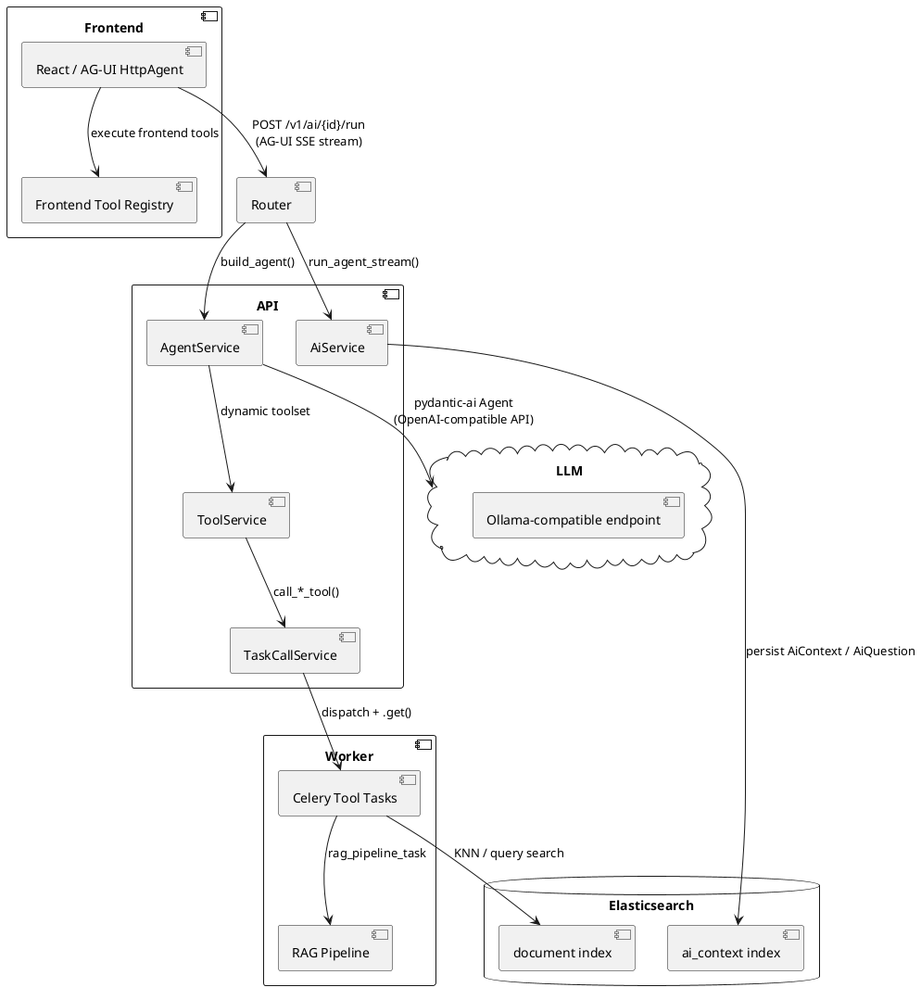
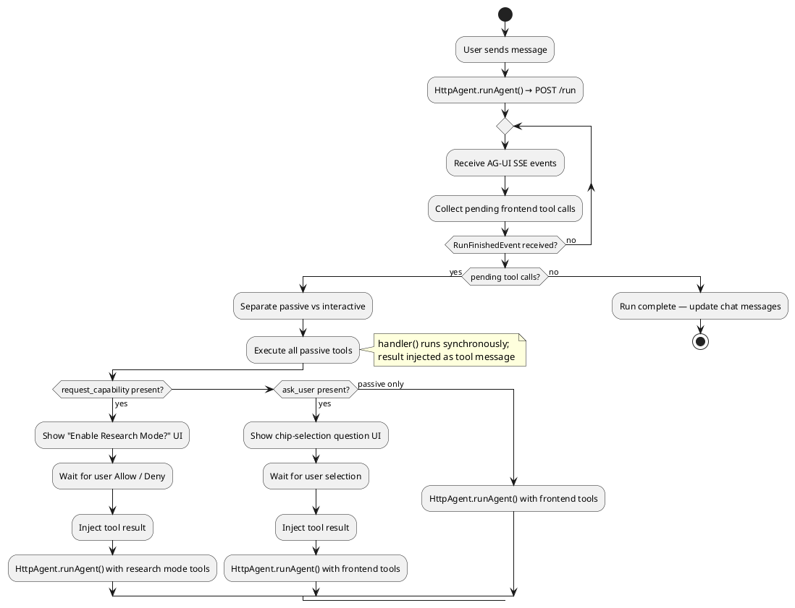
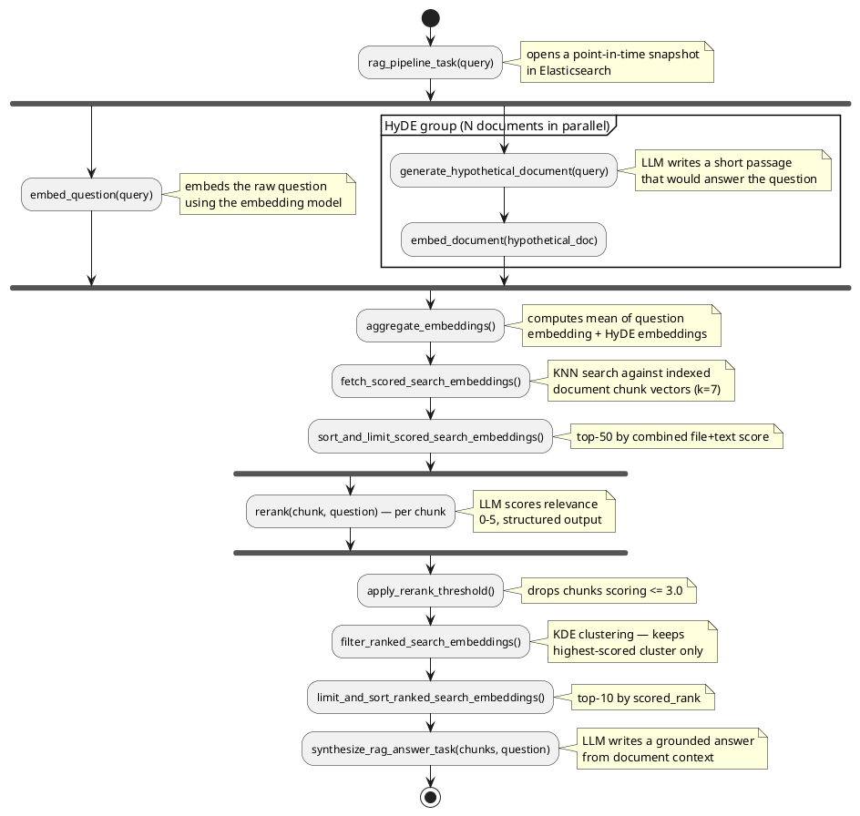

# AI Chatbot Architecture

Loom's AI chatbot lets users explore their indexed document corpus through natural language. Instead of
writing Lucene query strings by hand, users ask questions and the agent translates intent into search
actions, reads documents, manipulates the search UI, and synthesizes answers grounded in the corpus.

Two operating modes are available:

- **Base mode** — the default. The agent can inspect UI state, update the search view, and read
  individual document fields, but it does not perform large-scale retrieval.
- **Research Mode** — opt-in capability (`research_mode`). The agent runs full Elasticsearch queries
  and the RAG pipeline to synthesise answers from many documents at once. UI manipulation tools are
  disabled in this mode so the agent can focus on research.

---

## Architecture Overview

---

## Key Concepts

### AiContext

`AiContext` is the persistent container for a conversation. It is stored in the `ai_context`
Elasticsearch index and holds:

- **`questions`** (`list[AiQuestion]`) — the accumulated Q&A history. Each `AiQuestion` stores the
  question text, the agent's answer, `citations` (referenced file IDs with text snippets), and an
  `activity` list — an ordered record of `ToolCallActivityEntry` (name, inputs, output for each
  backend tool invocation) and `ReasoningActivityEntry` (LLM thinking traces) items.
- **`active_capabilities`** (`list[str]`) — opt-in flags that alter agent behaviour. Currently the
  only defined capability is `"research_mode"`.

A new context is created per conversation via `POST /v1/ai`. The frontend fetches its history on
load via `GET /v1/ai/{context_id}/history`.

### Agent and Tools

`AgentService` wraps a single pydantic-ai `Agent` configured with an OpenAI-compatible LLM (served
by Ollama or a compatible endpoint). The agent uses a **dynamic toolset**: when the request arrives
it inspects `AgentDeps.active_capabilities` and selects either `base_toolset` or
`research_mode_toolset` from `ToolService`.

Tools are split into two tiers:

- **Backend tools** — Python functions in `ToolService` that call `TaskCallService`, which
  dispatches a Celery task synchronously (`.get(timeout=…)`) and returns a typed result model.
- **Frontend tools** — TypeScript functions registered in the React frontend. The agent declares
  them as deferred tools; the frontend executes them after each agent run and re-submits results.

### AG-UI Streaming Protocol

The agent run is exposed as a Server-Sent Event (SSE) stream via pydantic-ai's `AGUIAdapter`. The
frontend connects using `@ag-ui/client`'s `HttpAgent`, which manages the message history and
re-run loop.

Key event types emitted downstream:

| Event | Meaning |
| --- | --- |
| `ToolCallStartEvent` | Agent started calling a tool |
| `ToolCallArgsEvent` | Incremental tool argument delta |
| `ToolCallResultEvent` | Tool returned a result |
| `TextMessageContentEvent` | Incremental text delta for the assistant reply |
| `CustomEvent` (`"citation"`) | A source file referenced in the answer |
| `RunFinishedEvent` | The agent run completed (or was interrupted for frontend tools) |

---

## Backend Tool Architecture

The following sequence shows a typical backend tool call through the stack.

After streaming completes, `AiService` emits `CustomEvent` messages for each deduplicated citation,
then `RunFinishedEvent`, then fires a background Celery task (`persist_question_task`) to append the
`AiQuestion` to the context in Elasticsearch — without blocking the response.

---

## Frontend Tool Architecture

Frontend tools run entirely in the browser. They are registered in `FrontendToolRegistry` and
advertised to the backend as deferred tool definitions. The LLM may call them like any other tool;
the frontend intercepts the call after each run finishes and executes the handler locally.

Tools are split into two categories:

### Passive tools (`interactive: false`)

Execute automatically — the handler runs, the result is injected as a `tool` message, and the agent
re-runs immediately.

| Tool | Purpose |
| --- | --- |
| `discover_state` | Returns a schema describing the available UI state keys |
| `read_state` | Reads a specific UI state slice (search query, filters, …) |
| `get_this_file` | Returns the file currently open in the detail pane |
| `get_these_files` | Returns the files currently visible in the search results |
| `set_search_query` | Updates the search bar query string |
| `navigate_to_file` | Opens a file in the detail pane |
| `highlight_file` | Highlights a file card in the search results |
| `navigate_sidebar` | Opens a specific panel in the right sidebar (summary, translate, …) |
| `update_file_flags` | Sets or clears a flag on a file |
| `add_tags_to_file` | Adds one or more tags to a file |
| `save_custom_query` | Saves the current query as a named custom query |
| `set_statistics_view` | Switches the statistics panel to a given view |
| `open_file_dialogs` | Opens a file action dialog (e.g. share, delete) |

### Interactive tools (`interactive: true`)

Pause execution and show UI; the agent re-runs only after the user responds.

| Tool | Purpose |
| --- | --- |
| `ask_user` | Presents a question and a set of chip options to the user for selection |
| `request_capability` | Asks the user to grant (or deny) a capability such as `research_mode` |

---

## Frontend Tool Execution Loop

In Research Mode, the frontend only advertises `get_this_file` (not the full UI manipulation
toolset) so the agent focuses on research rather than UI control.

---

## Available Tools Reference

### Backend tools

| Tool | Toolset | Description |
| --- | --- | --- |
| `suggest_queries` | base + research mode | Generates ranked Lucene query candidates from a natural language description. Optional `folder_path` parameter restricts results to a subtree. |
| `get_file` | base + research mode | Returns the full path and available field list for a file by UUID |
| `get_file_field` | base + research mode | Reads the value of a specific field for a file (e.g. `content`, `summary`) |
| `list_folder_contents` | base + research mode | Lists direct children (subfolders and files) of a folder path |
| `search_by_filename` | base + research mode | Finds files whose name contains a given substring |
| `summarize_file` | base | Triggers AI summarization for a file and returns the summary |
| `translate_file` | base | Triggers AI translation for a file and returns the translated text |
| `describe_image` | base | Triggers AI image description for an image file |
| `execute_query` | research mode | Executes a Lucene query and returns matching files with snippets. Optional `folder_path` parameter restricts results to a subtree. |
| `rag_search` | research mode | Runs the full RAG pipeline and returns a synthesized answer |

### Frontend tools

| Tool | Category | Description |
| --- | --- | --- |
| `discover_state` | passive / state reading | Returns a description of the available UI state keys |
| `read_state` | passive / state reading | Reads a UI state slice by key |
| `get_this_file` | passive / state reading | Returns the currently open file (available in all modes) |
| `get_these_files` | passive / state reading | Returns the files currently visible in the search results |
| `set_search_query` | passive / action | Updates the search bar with a new query string |
| `navigate_to_file` | passive / action | Opens a file in the detail pane |
| `highlight_file` | passive / action | Highlights a file card in the results list |
| `navigate_sidebar` | passive / action | Switches to a specific right-sidebar panel |
| `update_file_flags` | passive / action | Sets or clears a flag on a file |
| `add_tags_to_file` | passive / action | Applies tags to a file |
| `save_custom_query` | passive / action | Saves the current search as a named custom query |
| `set_statistics_view` | passive / action | Switches the active statistics chart |
| `open_file_dialogs` | passive / action | Opens file action dialogs |
| `ask_user` | interactive | Pauses execution and prompts the user with a multiple-choice question |
| `request_capability` | interactive | Asks the user to grant a capability (e.g. `research_mode`) |

---

## RAG Pipeline

The `rag_search` tool triggers `rag_pipeline_task` in the Celery worker, which orchestrates a
multi-stage retrieval pipeline using `self.replace()` to chain tasks:

Each stage is a discrete Celery task with auto-retry on LLM errors. The pipeline returns a
`RagSearchResult` containing the synthesized answer and the source `ToolSource` list used to
populate citations.

---

## Persistence Model

`AiContext` is stored in the Elasticsearch index `ai_context`. The document structure mirrors the
Pydantic model: a nested `questions` array (each an `AiQuestion` with `citations` and `activity`),
and an `active_capabilities` keyword list.

Persistence is non-blocking: after the SSE stream finishes, `AiService` dispatches two background
Celery tasks:

1. **`persist_question_task`** — appends the completed `AiQuestion` (including tool call audit trail
    and citations) to the context document.
2. **`persist_processing_done_task`** — marks the root task as finished for observability.

The context is capped at the 100 most-recent entries (`_MAX_CONTEXTS = 100`) when listed.

Frontend tool call results and reasoning traces that arrive in a re-run request (as
`AssistantMessage`/`ToolMessage`/`ReasoningMessage` groups in the AG-UI message history) are
extracted by `_extract_activity_from_history()` and prepended to the `AiQuestion.activity` list
alongside the current run's backend activity, giving a complete interleaved audit trail regardless
of where the tool executed.
